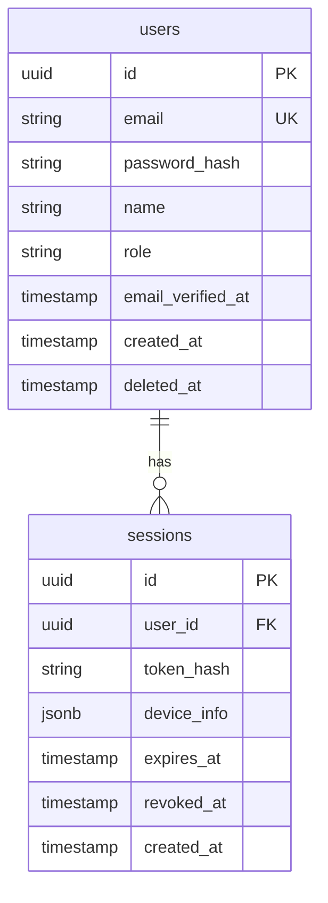

# 資料庫設計文件（DB Schema）

> **文件資訊**
> 
> | 欄位 | 內容 |
> |------|------|
> | 專案名稱 | {{project_name}} |
> | 文件版本 | {{version}} |
> | 撰寫人 | {{author}} |
> | 日期 | {{date}} |
> | 資料庫類型 | PostgreSQL 16 / MySQL 8.0 / [填入] |

---

## 修訂記錄

| 版本 | 日期 | 修訂人 | 說明 |
|------|------|--------|------|
| 1.0 | {{date}} | {{author}} | 初版建立 |

---

## 1. 資料庫概覽

### 1.1 架構說明

| 項目 | 說明 |
|------|------|
| 資料庫類型 | [PostgreSQL / MySQL / SQLite] |
| 版本 | [版本號] |
| 字元集 | UTF-8 |
| 時區 | UTC |
| 連線池大小 | 最小 5，最大 20 |
| 連線逾時 | 30 秒 |

### 1.2 命名規範

| 類型 | 規範 | 範例 |
|------|------|------|
| 資料表名稱 | snake_case，複數形 | `users`, `order_items` |
| 欄位名稱 | snake_case | `created_at`, `user_id` |
| 主鍵 | `id`（UUID 或 BIGINT） | `id` |
| 外鍵 | `{關聯表單數}_id` | `user_id`, `product_id` |
| 索引 | `idx_{表名}_{欄位}` | `idx_users_email` |
| 唯一約束 | `uq_{表名}_{欄位}` | `uq_users_email` |

### 1.3 通用欄位慣例

所有資料表預設包含以下稽核欄位：

| 欄位 | 類型 | 說明 |
|------|------|------|
| `id` | UUID / BIGSERIAL | 主鍵 |
| `created_at` | TIMESTAMPTZ | 建立時間（UTC） |
| `updated_at` | TIMESTAMPTZ | 最後更新時間 |
| `deleted_at` | TIMESTAMPTZ NULL | 軟刪除時間戳（NULL = 未刪除） |

---

## 2. 資料表目錄

| 表名 | 中文名 | 說明 | 預估筆數 |
|------|--------|------|---------|
| `users` | 用戶表 | 儲存所有用戶帳號資訊 | 10萬+ |
| `sessions` | 會話表 | 用戶登入會話記錄 | 50萬+ |
| `[table_name]` | [中文] | [說明] | [預估] |

---

## 3. 資料表詳細定義

---

### 3.1 users — 用戶表

**用途說明：** 儲存系統所有用戶的帳號資訊，包含認證資料與個人資料。

**欄位定義：**

| 欄位名 | 資料類型 | 可為 NULL | 預設值 | 說明 |
|--------|---------|-----------|--------|------|
| `id` | UUID | NOT NULL | `gen_random_uuid()` | 主鍵，用戶唯一識別碼 |
| `email` | VARCHAR(255) | NOT NULL | - | 用戶 Email，全小寫儲存 |
| `password_hash` | VARCHAR(255) | NULL | NULL | bcrypt Hash，第三方登入用戶為 NULL |
| `name` | VARCHAR(100) | NOT NULL | - | 用戶顯示名稱 |
| `role` | VARCHAR(20) | NOT NULL | `'user'` | 角色：`user` / `admin` |
| `avatar_url` | TEXT | NULL | NULL | 頭像圖片 URL |
| `email_verified_at` | TIMESTAMPTZ | NULL | NULL | Email 驗證時間，NULL 表示未驗證 |
| `last_login_at` | TIMESTAMPTZ | NULL | NULL | 最後登入時間 |
| `login_count` | INTEGER | NOT NULL | `0` | 累計登入次數 |
| `is_active` | BOOLEAN | NOT NULL | `true` | 帳號是否啟用 |
| `created_at` | TIMESTAMPTZ | NOT NULL | `NOW()` | 建立時間 |
| `updated_at` | TIMESTAMPTZ | NOT NULL | `NOW()` | 最後更新時間 |
| `deleted_at` | TIMESTAMPTZ | NULL | NULL | 軟刪除時間戳 |

**主鍵：** `id`

**唯一約束：**
| 約束名 | 欄位 | 說明 |
|--------|------|------|
| `uq_users_email` | `email` | Email 不可重複（僅對未軟刪除記錄） |

**索引：**
| 索引名 | 類型 | 欄位 | 說明 |
|--------|------|------|------|
| `idx_users_email` | BTREE | `email` | Email 查詢加速 |
| `idx_users_created_at` | BTREE | `created_at DESC` | 按建立時間排序 |
| `idx_users_deleted_at` | PARTIAL | `deleted_at IS NULL` | 軟刪除過濾 |

**範例資料：**
```sql
INSERT INTO users (id, email, name, role, email_verified_at) VALUES
  ('550e8400-e29b-41d4-a716-446655440001', 'admin@example.com', '系統管理員', 'admin', NOW()),
  ('550e8400-e29b-41d4-a716-446655440002', 'user@example.com', '一般用戶', 'user', NOW());
```

**DDL：**
```sql
CREATE TABLE users (
  id UUID PRIMARY KEY DEFAULT gen_random_uuid(),
  email VARCHAR(255) NOT NULL,
  password_hash VARCHAR(255),
  name VARCHAR(100) NOT NULL,
  role VARCHAR(20) NOT NULL DEFAULT 'user',
  avatar_url TEXT,
  email_verified_at TIMESTAMPTZ,
  last_login_at TIMESTAMPTZ,
  login_count INTEGER NOT NULL DEFAULT 0,
  is_active BOOLEAN NOT NULL DEFAULT true,
  created_at TIMESTAMPTZ NOT NULL DEFAULT NOW(),
  updated_at TIMESTAMPTZ NOT NULL DEFAULT NOW(),
  deleted_at TIMESTAMPTZ,
  CONSTRAINT uq_users_email UNIQUE (email)
);

CREATE INDEX idx_users_email ON users(email);
CREATE INDEX idx_users_created_at ON users(created_at DESC);
CREATE INDEX idx_users_active ON users(deleted_at) WHERE deleted_at IS NULL;
```

---

### 3.2 sessions — 會話表

**用途說明：** 記錄用戶的登入會話，支援多裝置登入與強制登出功能。

**欄位定義：**

| 欄位名 | 資料類型 | 可為 NULL | 預設值 | 說明 |
|--------|---------|-----------|--------|------|
| `id` | UUID | NOT NULL | `gen_random_uuid()` | 主鍵 |
| `user_id` | UUID | NOT NULL | - | 外鍵 → users.id |
| `token_hash` | VARCHAR(255) | NOT NULL | - | Refresh Token 的 SHA-256 Hash |
| `device_info` | JSONB | NULL | NULL | 裝置資訊（UA、IP、平台） |
| `expires_at` | TIMESTAMPTZ | NOT NULL | - | Token 到期時間 |
| `revoked_at` | TIMESTAMPTZ | NULL | NULL | 主動撤銷時間 |
| `created_at` | TIMESTAMPTZ | NOT NULL | `NOW()` | 建立時間 |

**外鍵：**
| 約束名 | 欄位 | 參照表 | 參照欄位 | ON DELETE |
|--------|------|--------|---------|-----------|
| `fk_sessions_user` | `user_id` | `users` | `id` | CASCADE |

**索引：**
| 索引名 | 欄位 | 說明 |
|--------|------|------|
| `idx_sessions_user_id` | `user_id` | 按用戶查詢 Session |
| `idx_sessions_token_hash` | `token_hash` | Token 驗證查詢 |
| `idx_sessions_expires_at` | `expires_at` | 過期清理排程 |

---

### 3.X [下一個資料表]

[依上方格式填寫]

---

## 4. ERD 實體關係圖



---

## 5. 遷移策略

### 5.1 遷移工具

使用 [Flyway / Liquibase / 自定義腳本] 管理 Schema 遷移。

遷移檔案路徑：`db/migrations/`

命名規則：`V{版本號}__{說明}.sql`，例：`V001__create_users_table.sql`

### 5.2 回滾策略

每個 Migration 需附帶 Undo Script，存放於 `db/undo/` 目錄。

---

## 6. 已知技術債

| 項目 | 說明 | 建議改善方向 | 優先級 |
|------|------|------------|--------|
| [技術債 1] | [說明] | [建議] | P1/P2/P3 |
