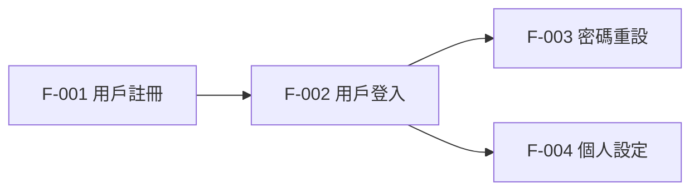

# 功能需求文件（FRD）

> **文件資訊**
> 
> | 欄位 | 內容 |
> |------|------|
> | 專案名稱 | {{project_name}} |
> | 文件版本 | {{version}} |
> | 撰寫人 | {{author}} |
> | 日期 | {{date}} |
> | 狀態 | {{status}} |

---

## 修訂記錄

| 版本 | 日期 | 修訂人 | 說明 |
|------|------|--------|------|
| 1.0 | {{date}} | {{author}} | 初版建立 |

---

## 1. 文件目的

本文件詳細描述 {{project_name}} 的每一項功能，作為開發、測試與驗收的依據。
每個功能以 User Story 格式描述，並附上詳細的驗收條件（Acceptance Criteria）。

---

## 2. 功能清單總覽

| 功能 ID | 功能名稱 | 模組 | 優先級 | 狀態 |
|---------|---------|------|--------|------|
| F-001 | 用戶註冊 | 用戶管理 | Must | 待開發 |
| F-002 | 用戶登入 | 用戶管理 | Must | 待開發 |
| F-003 | 密碼重設 | 用戶管理 | Must | 待開發 |
| F-004 | [功能名稱] | [模組] | [級別] | 待開發 |

---

## 3. 功能詳細規格

---

### F-001：用戶註冊

**User Story：**
> 作為一個新用戶，  
> 我希望能透過 Email 和密碼完成註冊，  
> 以便開始使用系統。

**前置條件（Pre-conditions）：**
- 用戶尚未擁有帳號
- 用戶的瀏覽器支援 JavaScript

**主要流程（Happy Path）：**
1. 用戶進入註冊頁面
2. 用戶填寫 Email、密碼、確認密碼
3. 用戶點擊「註冊」按鈕
4. 系統驗證資料格式正確
5. 系統發送驗證信至 Email
6. 用戶點擊驗證連結
7. 系統啟用帳號，跳轉至歡迎頁面

**替代流程（Alternative Paths）：**
- **Email 已存在：** 步驟 4 後，系統顯示「此 Email 已被使用」提示
- **格式不正確：** 步驟 4 後，系統在欄位旁顯示錯誤訊息
- **密碼不一致：** 步驟 4 後，確認密碼欄位顯示「密碼不一致」

**驗收條件（Acceptance Criteria）：**
- [ ] Email 格式驗證：需符合 RFC 5322 格式
- [ ] 密碼規則：至少 8 碼，包含大小寫英文及數字
- [ ] 確認密碼需與密碼欄位完全相同
- [ ] 驗證信需在 5 分鐘內送達
- [ ] 驗證連結有效期為 24 小時
- [ ] 超過 5 次失敗嘗試後，鎖定 15 分鐘
- [ ] 成功驗證後自動登入並跳轉首頁

**UI 說明：**
```
[截圖：註冊頁面 - 顯示 Email、密碼、確認密碼三個輸入欄及提交按鈕]
[截圖：驗證信樣式]
[截圖：成功驗證後的歡迎頁面]
```

**API 相依：**
- `POST /api/v1/auth/register`
- `POST /api/v1/auth/verify-email`

**業務規則：**
- 同一個 IP 每小時最多嘗試 10 次註冊
- Email 驗證未完成前，帳號不得登入

---

### F-002：用戶登入

**User Story：**
> 作為一個已註冊用戶，  
> 我希望能快速登入系統，  
> 以便存取我的個人資料與功能。

**前置條件：**
- 用戶已完成 Email 驗證
- 帳號未被停用

**主要流程：**
1. 用戶進入登入頁面
2. 用戶輸入 Email 和密碼
3. 系統驗證憑證
4. 登入成功，跳轉至首頁（或 return URL）

**替代流程：**
- **帳號不存在：** 顯示「Email 或密碼錯誤」（不揭露帳號是否存在）
- **密碼錯誤：** 顯示「Email 或密碼錯誤」，記錄失敗次數
- **帳號已鎖定：** 顯示鎖定原因和解鎖方式

**驗收條件：**
- [ ] 連續 5 次登入失敗後鎖定帳號 30 分鐘
- [ ] 記住我功能：Token 有效期 30 天
- [ ] 不記住：Session 關閉後登出
- [ ] 支援 Google OAuth 登入（單獨 Story 展開）
- [ ] 登入成功後設定 HttpOnly, Secure Cookie

**API 相依：**
- `POST /api/v1/auth/login`
- `GET /api/v1/auth/me`

---

### F-00X：[下一個功能]

[依上方格式填寫]

---

## 4. 功能依賴關係圖



---

## 5. 介面原型說明

### 5.1 頁面清單

| 頁面名稱 | 路由 | 說明 | 相關功能 |
|---------|------|------|---------|
| 登入頁 | `/login` | [說明] | F-002 |
| 註冊頁 | `/register` | [說明] | F-001 |
| 首頁 | `/` | [說明] | F-XXX |

---

## 6. 測試情境摘要

| 功能 ID | 測試情境 | 預期結果 | 測試類型 |
|---------|---------|---------|---------|
| F-001 | 正常流程：有效 Email + 強密碼 | 成功送出驗證信 | 功能測試 |
| F-001 | 邊界：已存在 Email | 顯示錯誤訊息，不建立帳號 | 負向測試 |
| F-001 | 邊界：弱密碼（少於 8 碼） | 顯示密碼規則提示 | 驗證測試 |
| F-002 | 正常流程：正確帳密 | 成功登入，跳轉首頁 | 功能測試 |
| F-002 | 安全：連續 5 次失敗 | 帳號被鎖定 30 分鐘 | 安全測試 |
