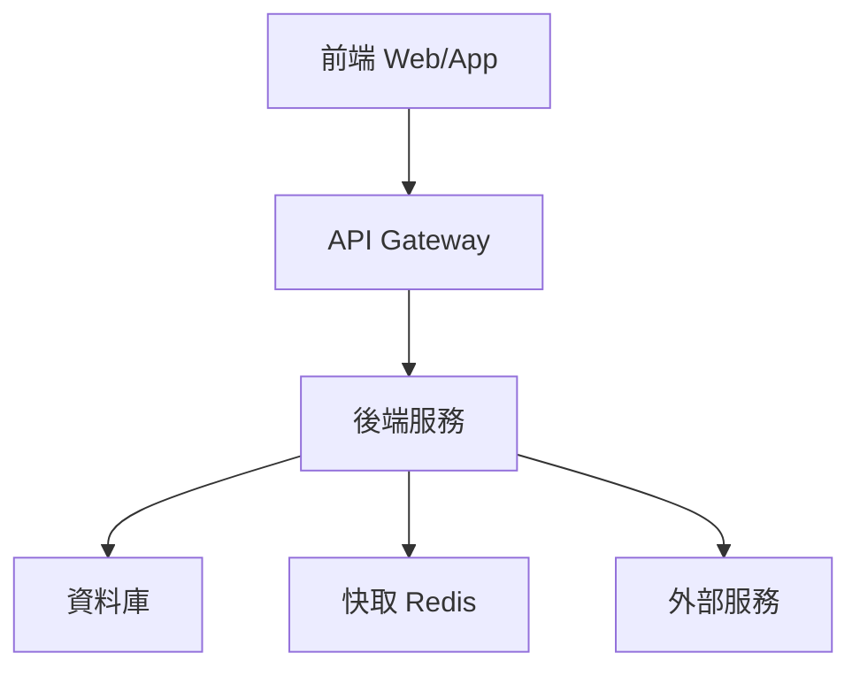

# 系統需求規格書（SRD）

> **文件資訊**
> 
> | 欄位 | 內容 |
> |------|------|
> | 專案名稱 | {{project_name}} |
> | 文件版本 | {{version}} |
> | 撰寫人 | {{author}} |
> | 日期 | {{date}} |
> | 狀態 | {{status}} |

---

## 修訂記錄

| 版本 | 日期 | 修訂人 | 說明 |
|------|------|--------|------|
| 1.0 | {{date}} | {{author}} | 初版建立 |

---

## 1. 系統概覽

### 1.1 系統目的

[描述系統的核心目的與業務價值]

### 1.2 系統範圍

**系統邊界：**
- **包含：** [系統負責的功能域]
- **不包含：** [系統不負責的部分，由哪個系統負責]

### 1.3 系統架構概覽

```
[用 ASCII 或 Mermaid 描述高層架構]
```



---

## 2. 功能性需求（Functional Requirements）

### 2.1 用戶管理子系統

| ID | 需求描述 | 優先級 | 來源 |
|----|---------|--------|------|
| FR-UM-001 | 系統應支援用戶以 Email + 密碼方式註冊 | Must | PRD §3.1 |
| FR-UM-002 | 系統應支援 Google OAuth 第三方登入 | Should | PRD §3.1 |
| FR-UM-003 | 密碼重設流程需透過驗證 Email 完成 | Must | PRD §3.1 |

### 2.2 [功能子系統 2]

| ID | 需求描述 | 優先級 | 來源 |
|----|---------|--------|------|
| FR-[模組]-001 | [需求描述] | [級別] | [來源] |

> 需求 ID 命名規則：FR-[模組縮寫]-[序號]

---

## 3. 非功能性需求（Non-Functional Requirements）

### 3.1 效能需求

| ID | 指標 | 需求值 | 測量條件 |
|----|------|--------|---------|
| NFR-PERF-001 | API 回應時間 | P95 < 300ms | 正常負載下 |
| NFR-PERF-002 | 頁面首次載入 | < 3 秒 | 4G 網路條件 |
| NFR-PERF-003 | 資料庫查詢 | P99 < 100ms | 單一查詢 |
| NFR-PERF-004 | 並發用戶支援 | 1000 同時在線 | 無效能降級 |

### 3.2 可用性與可靠性需求

| ID | 需求 | 指標 |
|----|------|------|
| NFR-AVAIL-001 | 系統年可用率 | ≥ 99.9%（SLA） |
| NFR-AVAIL-002 | RTO（恢復時間目標） | < 1 小時 |
| NFR-AVAIL-003 | RPO（恢復點目標） | < 15 分鐘 |
| NFR-AVAIL-004 | 計劃外停機次數 | ≤ 2 次/月 |

### 3.3 安全性需求

| ID | 需求描述 | 標準/參考 |
|----|---------|---------|
| NFR-SEC-001 | 所有 API 須進行身份驗證 | JWT / OAuth 2.0 |
| NFR-SEC-002 | 傳輸層加密 | TLS 1.2+ |
| NFR-SEC-003 | 密碼需加鹽 Hash | bcrypt / argon2 |
| NFR-SEC-004 | SQL Injection 防護 | Parameterized Query |
| NFR-SEC-005 | XSS 防護 | Content Security Policy |
| NFR-SEC-006 | CSRF 防護 | SameSite Cookie |
| NFR-SEC-007 | Rate Limiting | 100 requests/min/IP |

### 3.4 可擴展性需求

| ID | 需求描述 |
|----|---------|
| NFR-SCALE-001 | 水平擴展：Web 服務支援多實例部署 |
| NFR-SCALE-002 | 資料庫支援讀寫分離架構 |
| NFR-SCALE-003 | 靜態資源透過 CDN 分發 |

### 3.5 可維護性需求

| ID | 需求描述 |
|----|---------|
| NFR-MAINT-001 | 系統日誌需包含 Request ID、時間戳、錯誤詳情 |
| NFR-MAINT-002 | 關鍵操作需留有稽核記錄（Audit Log） |
| NFR-MAINT-003 | 配置參數需能在不重啟服務的情況下更新 |
| NFR-MAINT-004 | API 需向後相容（至少支援前一個主版本） |

---

## 4. 介面需求

### 4.1 使用者介面需求

| ID | 需求描述 |
|----|---------|
| UIR-001 | 支援繁體中文、英文雙語介面 |
| UIR-002 | RWD 響應式設計，支援 320px~2560px 螢幕寬度 |
| UIR-003 | 符合 WCAG 2.1 AA 無障礙標準 |

### 4.2 外部系統介面需求

| 外部系統 | 介面類型 | 說明 |
|---------|---------|------|
| [系統名稱] | REST API / Webhook / SDK | [說明整合目的與資料流] |

### 4.3 硬體介面需求

| 需求 | 說明 |
|------|------|
| 伺服器規格 | [最低配置需求] |
| 網路頻寬 | [最低需求] |

---

## 5. 資料需求

### 5.1 資料保留政策

| 資料類型 | 保留期限 | 說明 |
|---------|---------|------|
| 用戶操作日誌 | 90 天 | 法規要求 |
| 業務交易記錄 | 7 年 | 法規要求 |
| 系統日誌 | 30 天 | 運維需求 |

### 5.2 資料備份需求

| 備份類型 | 頻率 | 保留份數 | 儲存位置 |
|---------|------|---------|---------|
| 全量備份 | 每日 | 7 份 | 異地儲存 |
| 增量備份 | 每小時 | 24 份 | 本地 + 異地 |

---

## 6. 限制條件

### 6.1 技術限制

- [限制 1：例：需使用公司現有的 Kubernetes 叢集]
- [限制 2：例：資料庫必須使用 PostgreSQL 14+]

### 6.2 法規限制

- [法規 1：例：個資需符合 GDPR 規範]
- [法規 2：例：金融交易需符合 PCI DSS]

---

## 7. 驗收標準

### 7.1 功能驗收

- [ ] 所有 Must Have 功能完成開發與測試
- [ ] 所有 P1 Bug 已修復
- [ ] 通過 UAT（用戶驗收測試）

### 7.2 效能驗收

- [ ] 壓力測試通過（1000 並發，持續 30 分鐘）
- [ ] API 回應時間符合 NFR-PERF-001 標準

### 7.3 安全驗收

- [ ] 完成滲透測試，無高風險漏洞
- [ ] OWASP Top 10 掃描通過

---

## 附錄

### 相關文件

| 文件名稱 | 版本 | 說明 |
|---------|------|------|
| PRD | [版本] | 產品需求文件 |
| FRD | [版本] | 功能需求文件 |
